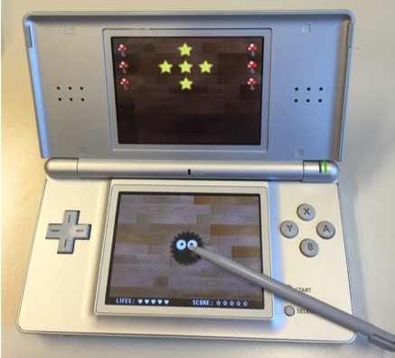

# Susuwatari Game
This repository contains the source of a game coded in C in the context of the Embedded Systems course at EPFL in 2016. The course was given by [Pr. David Atienza](https://people.epfl.ch/169199).

## Purpose of the Project : 
Design a game for the Nintendo DS. Using low level C Programming with the [libNDS library](https://github.com/devkitPro/libnds). Low level graphic programming. Input & Output handling. 

## Game  : 
The design of the game was inspired by [Hayao Miyasaki](https://en.wikipedia.org/wiki/Hayao_Miyazaki)'s universe, and the main character is the little [Susuwatari](https://en.wikipedia.org/wiki/Susuwatari)

## Who worked on this Project : 
[Adrian Löwenstein](https://www.linkedin.com/in/adrian-löwenstein/) - [Valentine Santarelli](https://www.linkedin.com/in/v-santarelli/)
